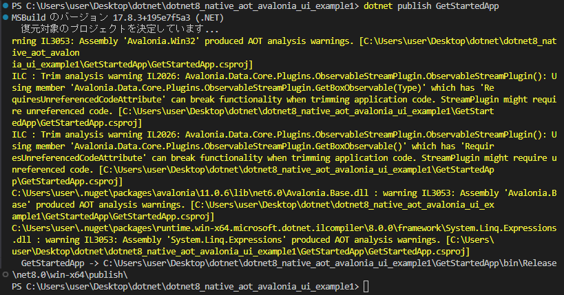
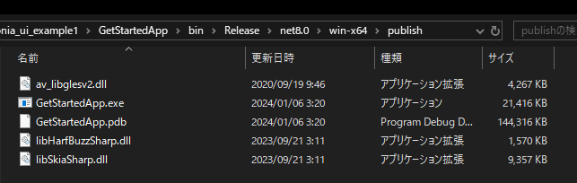
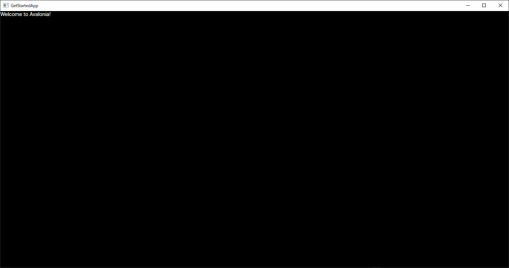
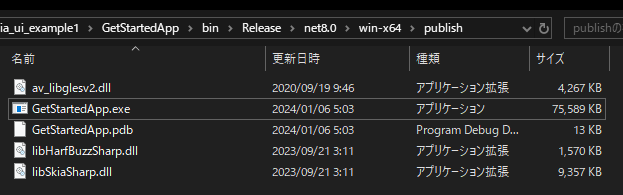
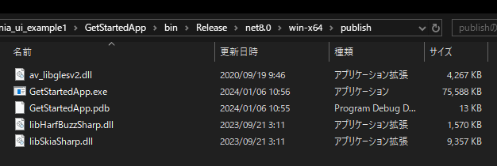

# dotnet8_native_aot_avalonia_ui_example1

## 概要

.NET 8 で Avalonia UI + NativeAOT が可能か検証する。  

Avalonia UI  
https://avaloniaui.net/  

## とりあえず普通に動かす

Create and Run a Project  
https://docs.avaloniaui.net/docs/get-started/test-drive/create-a-project

```
dotnet new install Avalonia.Templates
```

```
dotnet new avalonia.app -o GetStartedApp
```

```
dotnet run --project GetStartedApp
```


## NativeAOT化

### 結果  
→　起動できた(※)  
→　PDB ファイルを抜くと約 35 MB (exe 以外に dll があり計 4 ファイル) 

※ビルド中に色々警告は出てたので、全ての機能が正常に動くかは不明

### 詳細

GetStartedApp\GetStartedApp.csproj
```xml
<PropertyGroup>
    <PublishAot>true</PublishAot>　★追加
</PropertyGroup>
```

```
dotnet publish GetStartedApp
```
何か色々警告出てるけど…





普通に動いてワロタ



### 参考

NativeAOT せず SingleFile でビルドした場合  
→　約 90 MB (※)

※PDF ファイル込みだとこっちの方が小さい。なんで？

```xml
<PropertyGroup>
    <!-- <PublishAot>true</PublishAot> -->
    <PublishSingleFile>true</PublishSingleFile>
</PropertyGroup>
```



## クロスコンパイル可能か

### NativeAOT

→　無理  
そもそも NativeAOT がクロスコンパイルをサポートしていない。  
※ビルド時にサポート外エラーになる。

### SingleFile 

→　ビルドできるが起動しない

```
dotnet publish GetStartedApp --os win
```

ビルドできたが exe のサイズが 1 KB 違う…  
→　exe 実行しても反応なし　※エラーは後述



イベントビューアーを確認  
publish に GetStartedApp.dll が無いらしい。  
お前の中にあるだろ...

```
Description: A .NET application failed.
Application: GetStartedApp.exe
Path: C:\Users\user\Desktop\dotnet\dotnet8_native_aot_avalonia_ui_example1\GetStartedApp\bin\Release\net8.0\win-x64\publish\GetStartedApp.exe
Message: The application to execute does not exist: 'C:\Users\user\Desktop\dotnet\dotnet8_native_aot_avalonia_ui_example1\GetStartedApp\bin\Release\net8.0\win-x64\publish\GetStartedApp.dll'.
```

GetStartedApp.dll を上から持ってきてみたがやっぱりダメ

```
Description: A .NET application failed.
Application: GetStartedApp.exe
Path: C:\Users\user\Desktop\dotnet\dotnet8_native_aot_avalonia_ui_example1\GetStartedApp\bin\Release\net8.0\win-x64\publish\GetStartedApp.exe
Message: Could not resolve CoreCLR path. For more details, enable tracing by setting COREHOST_TRACE environment variable to 1
```

## 環境

ローカル　※Windows
```
> dotnet --info
.NET SDK:
 Version:           8.0.100
 Commit:            57efcf1350
 Workload version:  8.0.100-manifests.3b83835e

ランタイム環境:
 OS Name:     Windows
 OS Version:  10.0.19045
 OS Platform: Windows
 RID:         win-x64
 Base Path:   C:\Program Files\dotnet\sdk\8.0.100\
```

VM　※Linux
```
vagrant@vagrant:~$ dotnet --info
.NET SDK:
 Version:           8.0.100
 Commit:            57efcf1350
 Workload version:  8.0.100-manifests.6c33ef20

Runtime Environment:
 OS Name:     ubuntu
 OS Version:  23.04
 OS Platform: Linux
 RID:         linux-x64
 Base Path:   /usr/share/dotnet/sdk/8.0.100/
```